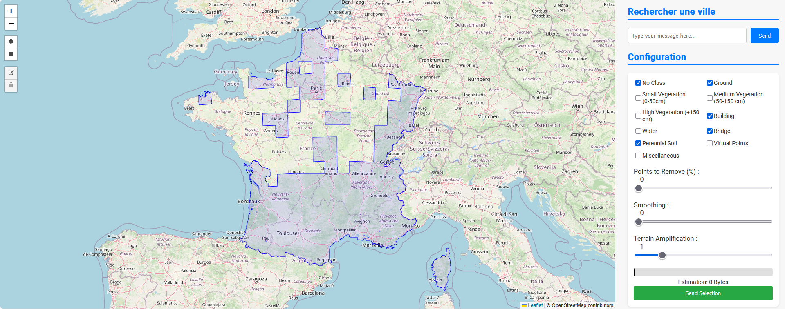
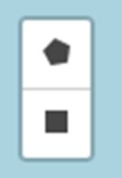
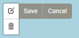
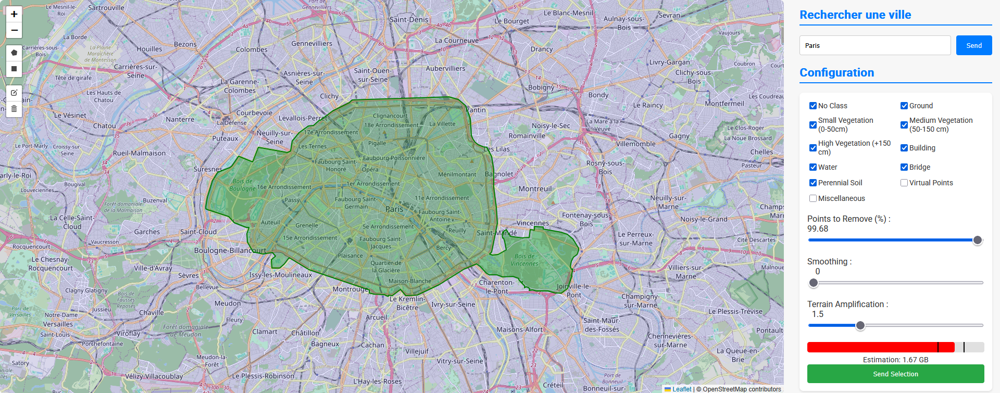

# France STL

A program that let you select a zone and give you the 3D file of that zone (STL file).

The data comes from the [IGN LIDAR HD program](https://geoservices.ign.fr/lidarhd)

## Web interface
### Home page presentation

You will land on the home page composed by 2 main parts : 
1. The map where you can select a zone (All the blue regions are available)
2. The parameters for the creation of the 3D file.

### The map
Select a zone with the Rectangle or Polygon button 



You can edit or delete a zone with these two buttons. (Do not forget to click on `Save` after your change)



### Find a location

You can also search for a city or region in the search bar (Here : "Paris")



### Use the parameters
#### Points classes
The data is classified into categories. You can choose which categories you want to keep by checking the boxes. You can see the details [here](https://geoservices.ign.fr/sites/default/files/2024-09/DC_LiDAR_HD_1-0.pdf) (Chap 4.2.8)

#### Points to remove
The data contains at least 10 points per square meter. for a large zone the final 3D file may be too large to be useful. This option let you choose the right percentage of point to remove from the data. This parameter is the main one (with the zone area) influencing the 3D file size.(LINK ESTIMATION)

#### Smoothing
This parameter let you smooth the final 3D file. Without smoothing, the 3D file may feel too solid. For a smoothing of `2`, the 3D file will be more 'organic'.

The vegetation result is not very good : You can remove it, or you can set the smoothing on `2` or more to have decent result.

#### Terrain amplification
For a zone as big as a city, the buildings will be very small. You can amplify the height of the 3D file with this parameter. I recommend a `1.5` parameter.

#### Estimation
This is the estimation of the generated 3D file. I recommend to not generated a file above 1GB. You can see 2 black bar, these represent the uncertainty of the estimation.

#### Information text
Below the `Send Selection` button, a text will indicate you the current step of the 3D model generation. A red message may appear if the program encounter an error. While the red errror message do not appear, then the program running and you do not have to do anything. The process may take a long time.

## For the developers

### Launch the project
Initialyze the virtual environment
```bash
uv venv --python 3.12
.venv\Scripts\activate
uv pip install -r requirements.txt
```

Regenerate the `requirements.txt`
```bash
uv pip compile --no-annotate --no-header -o requirements.txt requirements.in
```

Launch the project
```bash
python backend.py
```

And go the url [http://127.0.0.1:5000](http://127.0.0.1:5000)

### Project organization
```
.
├── assets/             ──>  Images for the README
├── benchmark/          ──>  Script that execute, analyze and plot benchmark
├── data/
    ├─> cache/
    ├─> data_grille/
    ├─> logs/
    ├─> orders/
    ├─> point_cloud/
    └─> raw_point_cloud/
├── templates/          ──>  The frontend webpage
├── utils/              ──>  Some utils script
├─> requirements.in     ──>  Contains the main libraries
├─> requirements.txt    ──>  Contains all libraries of the project (generated by `uv`)
├─> backend.py          ──>  The Flask socketio backend
└─> tiles.py            ──>  Contains the functions that manage the data transformation
```


## External services
nominatim
ign lidar

## Data origin

ign lidar